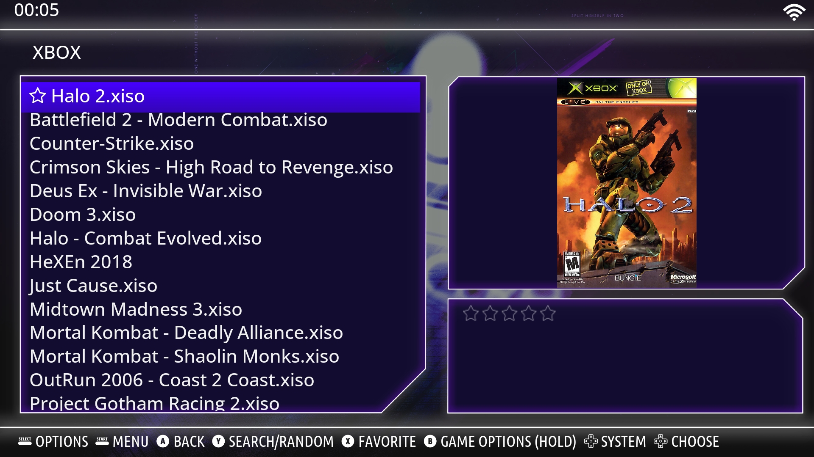

Batocera Pulse Theme Purple

Description :
Pulse Theme is a playful modern dark theme for Batocera Linux
Pulse Theme brings a cozy, modern vibe to your Batocera Setup

But this one is more PURPLE!

What you'll get :
Clean, dark aesthetic that puts your games front and Center
Playful icon set for a touch of personality in every menu
10 colorful wallpapers you can rotate or lock to your favorite
Snappy navigation with readable typography and clear focus states
Lightweight assets designed to run smoothly on low-power devices
6 different Gamelist Background PNGs Styles

Previews :

Compatibility :
Tested with Batocera v40, v41, v42
Works best at 1080p; scales fine down to 720p

Install :
On your Batocera device, enable SSH or use the F1 Filemanager.
Copy the theme folder to:

/userdata/themes/

In Main Menu → UI Settings → Theme Set, select batovera.
Optional: in Theme Configuration, choose your wallpaper variant.

Customize :
Toggle between the 10 wallpapers in Theme Options.
Toggle between the 6 Gamelist Background PNGs in Assets Folder.

Gamelist Styles :
main (gamelist.png)
shadow (gamelist_shadow.png)
dark (gamelist_dark.png)
light (gamelist_light.png)
purple (gamelist_puprle.png)
mix (gamelist_mix.png)

Aspect Ratio :
16/9 (PC)
4/3 (Handheld/Console)

Backgrounds :
10x Cusom Batocera Pulse Wallpapers (MIX 1-10)

Notes :
If you’re upgrading from an older release, delete any cached theme data to avoid mixed assets.
On very old GPUs, disable transitions for max smoothness.

Batocera Pulse Theme by complicatiion aka sksdesign
https://github.com/complicatiion

Batocera Pulse Theme based on ES-A-StarWars-Theme by soaremicheledavid
https://github.com/soaremicheledavid/ES-A-StarWars-Theme
https://github.com/soaremicheledavid/

Acknowledgments :
Fonts source : https://fonts.google.com/
Logos source : https://commons.wikimedia.org/
Icons and Images personalized in Photoshop

LICENSE CC BY-NC-SA 4.0 SMD & complicatiion aka sksdesign ©
You are free to:
Share — copy and redistribute the material in any medium or format
Adapt — remix, transform, and build upon the material
The licensor cannot revoke these freedoms as long as you follow the license terms.
Under the following terms:
Attribution — You must give appropriate credit , provide a link to the license, and indicate if changes were made . You may do so in any reasonable manner, but not in any way that suggests the licensor endorses you or your use.
NonCommercial — You may not use the material for commercial purposes .
ShareAlike — If you remix, transform, or build upon the material, you must distribute your contributions under the same license as the original.
No additional restrictions — You may not apply legal terms or technological measures that legally restrict others from doing anything the license permits.
Disclaimer: See additional LICENSE.md

Thanks to
soaremicheledavid
EmulationStation DE Developers
BATOCERA Linux Developers
Emulation Community

Enjoy the mix of minimal and playful Theme!
